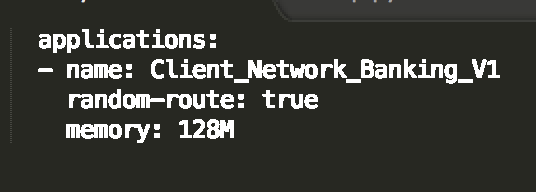

# Banking Risk Mitigation using NLU Studio

Knowing your Customer is an essential best practice because it is the foundation for all succeeding steps in the credit risk management process. To be successful, you must operate on pertinent, accurate, and timely information. The information you gather and the relationships you establish are critical to positioning yourself as a valued financial consultant and provider of financial products and services. Establishing a good relationship can bring a long stream of equity to your institution.

A poorly planned and executed initial call could limit your opportunity for future business. 


## Flow

1. The user interacts with the app UI to request relevant information corresponding to an event or a client
2. The web app UI interacts with the Python-Flask server to receive the required information from the appropriate api.
3. The flask apis scrape real-time news from popular online news portals. 
4. The scraped data is sent to NLU Studio to extract important entities and is pushed back to the UI through another flask api.


## Included Components

* [Watson Natural Language Understanding](https://console.bluemix.net/catalog/services/natural-language-understanding): An IBM Cloud service that can analyze text to extract meta-data from content such as concepts, entities, keywords, categories, sentiment, emotion, relations, semantic roles, using natural language understanding.

## Featured Technologies

* [Natural Language Processing](https://www.ibm.com/watson/services/natural-language-understanding): Natural Language Processing is a field that covers computer understanding and manipulation of human language, and it’s ripe with possibilities for newsgathering.
* [Cloud](https://www.ibm.com/developerworks/learn/cloud/): Accessing computer and information technology resources through the Internet.
* [Python](https://www.python.org/): Python is a programming language that lets you work more quickly and integrate your systems more effectively.

# Deploy to IBM Cloud

Create an [IBM Cloud account](https://console.bluemix.net/registration/?target=%2Fdashboard%2Fapps) and directly deploy the application using the button below.

[](https://bluemix.net/deploy?repository=)

Insert Git Link later


# Watch the Video


## Prerequisite
* [Python](https://www.python.org/downloads/)
* [Git](https://git-scm.com/downloads)
* [IBM Cloud account](https://console.bluemix.net/registration/?target=%2Fdashboard%2Fapps)
* [IBM Cloud CLI](https://console.bluemix.net/docs/cli)

## Steps
1. [Clone the repo](#1-clone-the-repo)
2. [Create IBM Cloud service](#2-create-ibm-cloud-service)
3. [Update the NLU service credentials](#3-update-the-nlu-service-credentials)
4. [Run the Application locally](#4-run-the-application-locally)
5. [Run the Application on IBM Cloud](#5-run-the-application-on-ibm-cloud)

## 1. Clone the repo

Now you're ready to start working with the app. Clone the repo and change to the directory where the sample app is located.
  ```
git clone https://github.com/IBM/banking-risk-mitigation-nlu-studio
cd banking-risk-mitigation-nlu-studio
  ```

  Peruse the files in the *get-started-python* directory to familiarize yourself with the contents.
  
## 2. Create IBM Cloud service

Create the following IBM Cloud service. Select the appropriate region, organization and space:

  * [**Watson Natural Language Understanding**](https://console.bluemix.net/catalog/services/natural-language-understanding)

  
  
## 3. Update the NLU service credentials

Open the Watson Natural Language Understanding service in your [IBM Cloud Dashboard](https://console.bluemix.net/dashboard/services) and click on your Natural Language Understanding service.

Once the service is open click the `Service Credentials` menu on the left.


In the `Service Credentials` that opens up in the UI, select whichever `Credentials` you would like to use in the notebook from the `KEY NAME` column. Click `View credentials` and copy `username` and `password` key values that appear on the UI in JSON format.


* Navigate to the cloned repo and open the file `app.py`.
* Go to the section in the code which declares `natural_language_understanding` instance.
* Update the `username` and `password` key values in the code.


## 4. Run the Application locally

Install the dependencies listed in the [requirements.txt](https://pip.readthedocs.io/en/stable/user_guide/#requirements-files) file to be able to run the app locally.

You can optionally use a [virtual environment](https://packaging.python.org/installing/#creating-and-using-virtual-environments) to avoid having these dependencies clash with those of other Python projects or your operating system.
  ```
pip install -r requirements.txt
  ```

Run the app.
  ```
python app.py
  ```

View your app at: http://localhost:8000


## 5. Run the Application on IBM Cloud

You can push the app to IBM Cloud using [IBM Cloud CLI](https://console.bluemix.net/docs/cli). This will use the services and application name in the `manifest.yml` file.  From your root directory login into IBM Cloud using CLI:
```
ibmcloud login
```
And push the app to IBM Cloud:
```
ibmcloud push Client_Network_Banking_V1
```

If you wish to change the name of the IBM Cloud application- Navigate to the `manifest.yml` file and update the `name` field.




# Troubleshooting

* To troubleshoot your IBM Cloud application, use the logs. To see the logs, run:

```bash
ibmcloud logs Client_Network_Banking_V1 --recent
```

# License

[Apache 2.0](LICENSE)


